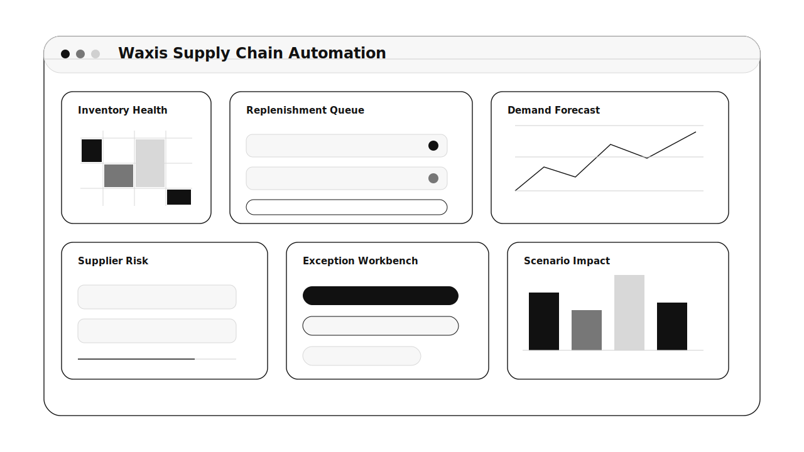

# Waxis Supply Chain & Inventory Automation

AI-assisted supply chain software for inventory health, replenishment, supplier risk, warehouse exceptions, demand shifts, and planner approval workflows.

## What It Is

Waxis Supply Chain & Inventory Automation connects ERP, WMS, order, supplier, forecast, and spreadsheet data into one operations layer. It helps inventory and procurement teams see risk early, understand why it is happening, and approve the next best action.

The product is not an ERP replacement. It is an AI control tower and planner workbench built on top of existing business systems.

## What Users See

The dashboard is designed for daily planning review. A user can quickly see:

- Which SKUs and locations are at stockout risk
- Where inventory is aging, excess, or slow-moving
- Which purchase orders or suppliers threaten customer commitments
- Which replenishment actions AI recommends and why
- Which warehouse exceptions need attention first
- How forecast changes affect service level and working capital
- Which actions were approved, edited, deferred, or rejected

## Core Product Screens

- Inventory Health: SKU-location risk, days of supply, stockout date, excess value, and aging
- Replenishment Queue: recommended quantity, assumptions, confidence, impact, and approval state
- Supplier Risk: late PO alerts, lead-time variance, affected SKUs, and escalation drafts
- Exception Workbench: prioritized stockout, overstock, demand spike, warehouse, and data-quality issues
- Scenario Studio: what-if analysis for demand, lead time, service level, and inventory policy
- Planner Assistant: source-backed explanations and suggested actions over governed operations data

## A Typical Workflow

1. The system syncs inventory, orders, purchase orders, supplier data, and demand signals.
2. AI detects stockout, overstock, late PO, demand spike, or data-quality exceptions.
3. The planner reviews recommendations with source data, assumptions, and expected impact.
4. The planner approves, edits, defers, or rejects the recommendation.
5. Approved actions create draft purchase, transfer, supplier, or warehouse tasks where integrations allow.
6. Decisions are logged so the team can measure acceptance, risk avoided, and planning quality.

## Who It Is For

- Inventory planners managing many SKUs and locations
- Procurement teams watching supplier reliability
- Warehouse managers prioritizing exception work
- Supply chain leaders balancing service level and inventory cost
- Finance teams tracking working capital tied in inventory

## MVP Shape

The first version should feel like an AI planning cockpit: risk is visible, recommendations are explainable, stale data is obvious, and every operational action stays reviewable.

## Product Requirements

The complete product requirements document is here:

- [PRD.md](./PRD.md)

## Research Basis

This repo uses a June 2026 research snapshot across official supply-chain planning, AI-agent, demand-sensing, inventory, and enterprise-governance sources, including SAP IBP, Oracle SCM AI Agents, AWS demand sensing, Blue Yonder supply chain research, NIST AI RMF, and OWASP LLM Top 10.

